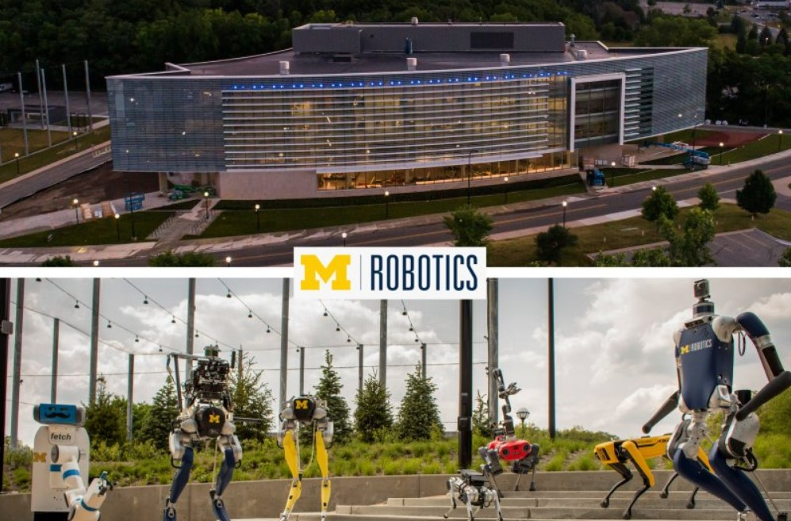

<!---->
<!--## Hi there 👋-->

<!--
**spsingh37/spsingh37** is a ✨ _special_ ✨ repository because its `README.md` (this file) appears on your GitHub profile.

Here are some ideas to get you started:

- 🔭 I’m currently working on ...
- 🌱 I’m currently learning ...
- 👯 I’m looking to collaborate on ...
- 🤔 I’m looking for help with ...
- 💬 Ask me about ...
- 📫 How to reach me: ...
- 😄 Pronouns: ...
- ⚡ Fun fact: ...
-->

<!--

<h2> Hey there! I'm Surya. 👋</h2>

<h3> 👨🏻‍💻 &nbsp;About Me </h3>

- 🤔 &nbsp; I'm currently looking for full-time roles.
- 🎓 &nbsp; Studied Robotics at University of Michigan.
- 💼 &nbsp; Working as a Perception & Learning Research Assistant at ROAHM Lab.
<!--- 🌱 &nbsp; Learning more about Cloud Architecture, Systems Design and Artificial Intelligence.
- ✍️ &nbsp; Pursuing Graphic Design and Blog Writing as hobbies/side hustles.-->

<h3> 🛠 &nbsp;Tech Stack</h3>

- 💻 &nbsp;
  
  
- 🌐 &nbsp;
  
  
- ⚙️ &nbsp;
  
  
  
- 🔧 &nbsp;
  

 

<a href="https://github.com/spsingh37">
  <!---->
  
</a>

 

<h3> 🤝🏻 &nbsp;Connect with Me </h3>

⭐️ From [spsingh37](https://github.com/spsingh37)-->

<h1 align="center">Hi 👋 I'm Surya</h1>

# 💫 About Me:
I am a graduate from the Robotics MS department of University of Michigan, working as a Perception & Learning Research Assistant at the ROAHM Lab. I'm passionate about building machine learning and computer vision tools for autonomous systems more specifically robot control, scene understanding, SLAM, state estimation, and motion planning. I also like deploying AI in other applications such as heathcare to make meaningful impact.

## 🚀 What I'm Up To

- 🤔 Currently looking for full-time roles
- 🤖 Building a robust control policy for Autonomous Racing in the real world

Check out my [portfolio!](https://spsingh37.github.io/)

## 🌐 Connect with me:

# 💻 Tech Stack:
Languages: 
 
 

Developer Tools: 

Libraries/Frameworks: 
 
 

